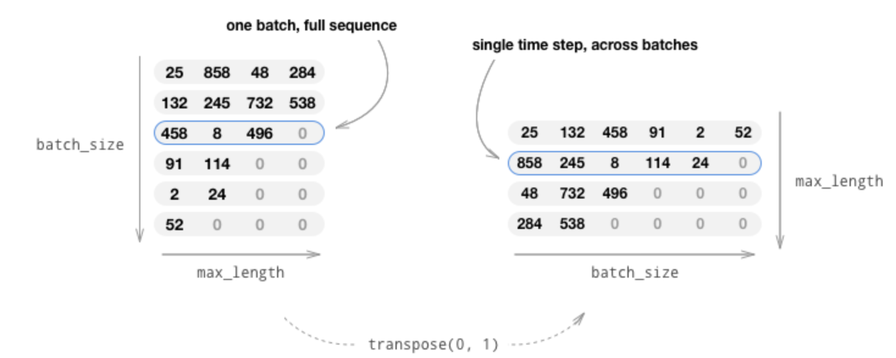

## Environment
1. torchtext
need to manually install `pip install torchtext`


##Issues
# Working with the model wrapped by DataParalle

1. RNN layer need to flatten_parameters() in each forward function
```
    def forward(self, text, offsets):
        x = self.embed(text, offsets)
        x = x.reshape(-1, 1, self.embed_size)
        self.lstm.flatten_parameters()
        x, _ = self.lstm(x)
        x = x.reshape(-1, self.lstm_hidden_size)
        x = self.fc(x)
        return x
``` 

2. or consider to switch from DataParallel to DistributedDataParallel (not validated)


##Tips
# Zero padding of text sentences
1. build padded batches by torch.nn.functional.pad and nn.utils.rnn.pad_sequence, shape [batch_size, max_length]
```
 texts = [F.pad(entry[1], (0, self.max_sequence_len-len(entry[1]))) for entry in batch]

 texts = nn.utils.rnn.pad_sequence(texts, batch_first=True, padding_value=0)
```

**RNN flow should be like: pack sequence (nn.utils.rnn.pack_padded_sequence()) -> RNN network -> unpack sequence (nn.utils.rnn.pad_packed_sequence())**

2. by itertools,.zip_longest(*l, fillvalue), shape [max_length, batch_size], by this way, the input will give a full sentence by time-steps, see the picture:
 

```
#refer https://pytorch.org/tutorials/beginner/chatbot_tutorial.html?highlight=padding

def zeroPadding(l, fillvalue=PAD_token):
    return list(itertools.zip_longest(*l, fillvalue=fillvalue))

def inputVar(l, voc):
    indexes_batch = [indexesFromSentence(voc, sentence) for sentence in l]
    lengths = torch.tensor([len(indexes) for indexes in indexes_batch])
    padList = zeroPadding(indexes_batch)
    padVar = torch.LongTensor(padList)
    return padVar, lengths
```

3. using `model.train()` or `model.eval()` to enable or disable dropout in tain mode or eval mode

4. to move optimizer to gpu, it's not possbile to use `optimzizer.to('cuda')` for torch.optim.Optimizer has no .to() function, the right way is:
```
        for state in en_optimizer.state.values():
            for k, v in state.items():
                if isinstance(v, torch.Tensor):
                    state[k] = v.to(self.device)
```
